<h1>Actividad1-CC3S2</h1>
<h2>1. Configuración del entorno</h2>
<h3>- Proyecto: Utilizaremos una aplicación web sencilla utilizando Node.js. Esta aplicación tendrá una API REST básica con un único endpoint que devuelve un mensaje de  "<b>Hello, World!</b>"</h3>

<b>1. Inicializa el proyecto de Node.js:</b>

En el escritorio crearemos la carpeta <b>devops-practice</b> en el cual inicializaremos el proyecto Node.js con <b>npm init -y.</b> 

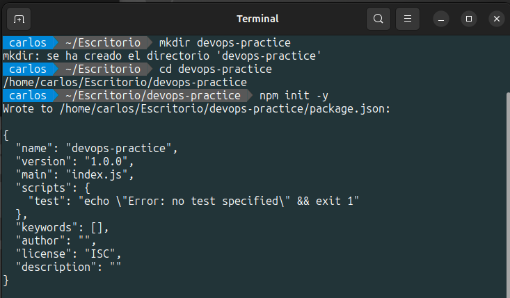

<b>2. Instala las dependencias necesarias:</b>

Instalaremos el Framework Express para el manejo de peticiones HTTP y Jest es un paquete NPM para crear, ejecutar y estructurar pruebas.

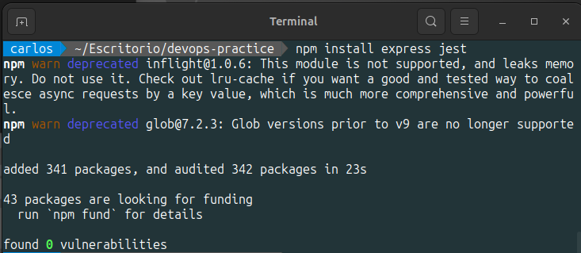

<b>3. Crea la estructura del proyecto:</b>

Crearemos la carpeta <b>src y tests</b> en el cual crearemos los scripts vacios <b>app.js y app.test.js</b> respectivamente.

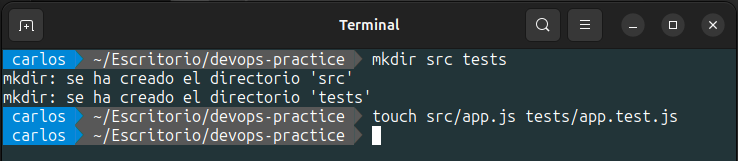

<b>4. Implementa la API REST en src/app.js:</b>

El script <b>app.js</b> solo contendra laconfiguración de la aplicación y funcionara de la siguiente manera: Se importa el modulo Express para inicializar una nueva aplicación Express, esta aplicación se le asigna a la constante <b>app</b>. Se define la ruta GET en la raíz ('/'), cuando se acceda a esta ruta raíz esta nos dará la respuesta <b>Hello, World!</b>. Se exporta la aplicación <b>app</b> para que pueda ser utilizada por otros módulos.

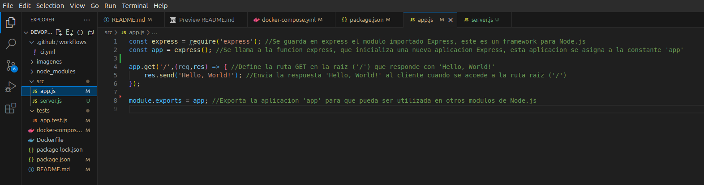

Se creara el script <b>server.js</b> el cual tendra la logia del inicio del servidor asi como el puerto que sera utlizado para escuchar las solicitudes de los clientes.

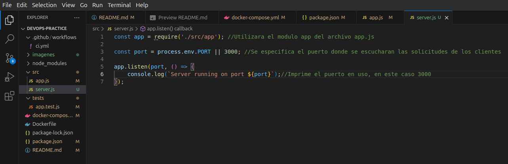

<b>5. Escribe un test básico en tests/app.test.js</b>

El script app.test.js funcionara de la siguiente manera: Se importa la librería <b>supertest</b>, esta es una librería para realizar pruebas en aplicaciones web. Se importa <b>Express</b> desde <b>app.js</b>. Se hará uso de un servidor Express el cual se iniciara al ejecutar las pruebas y terminara al finalizar las pruebas, este servidor se ejecutara en un puerto dinámico, en <b>describe</b> se define el conjunto de pruebas para la ruta <b>'GET /'</b>. En <b>it</b> se define el test, el primer argumento de <b>it</b> es lo que debería hacer el código, el segundo argumento es la lógica de la prueba asincronía, <b>resquest(app).get('/')</b> usa <b>supertest</b> para hacer una solicitud <b>HTTP GET</b>  a la ruta <b>`/`</b>. Usamos <b>expect(res.statusCode).toEqual(200)</b> para verificar que la respuesta tenga un código de estado <b>200</b>, lo que indica que la solicitud fue exitosa seguidamente usamos <b>expect(res.text).toBe('Hello, World!')</b> para verificar que la aplicación responda correctamente a la solicitud del cliente.

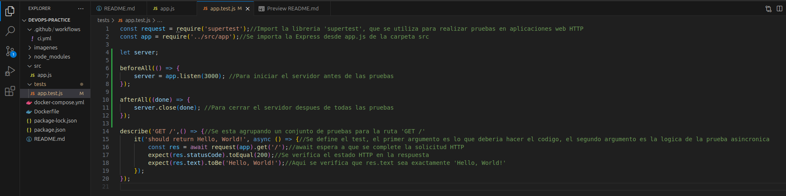

<b>6. Configura el script de test en package.json</b>

En <b>package.json</b> gestionaremos la configuración de nuestro proyecto, al cual se aginaremos en nombre de <b>devops-practice</b> con una version de <b>1.0.0</b>, también utilizaremos el script npm <b>jet</b>, como dependencia utilizaremos el framework <b>Express</b>, en <b>devDependencies</b> utilizaremos la version <b>27.0.0</b> de <b>jest</b> y la version <b>6.1.3</b> de <b>supertest</b>.

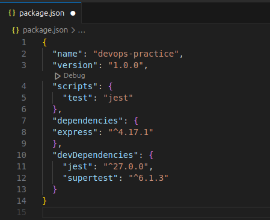

<h2>2. Pipeline CI/CD</h2>

<h3>Parte 1: Configura integración continua (CI) con GitHub Actions</h3>
<h3>- Crea un archivo de configuración para GitHub Actions:</h3>

<b>1. Crea la estructura para GitHub Actions:</b>

Crearemos el directorio <b>.github/workflows</b> donde ira el archivo de configuración de <b>GitHub Actions</b>, este archivo define el flujo de trabajo de <b>CI/CD</b> y se ejecutarán en respuesta a eventos en el repositorio.

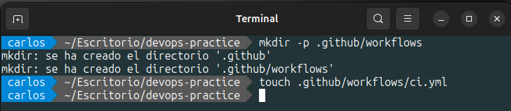

<b>2. Define el flujo de trabajo en .github/workflows/ci.yml:</b>

convierte en la entrada del siguiente. Esto facilita la comunicación y sincronización entre los procesos. El archivo <b>ci.yml</b> se ejecutará cada vez que haya un <b>push</b> o <b>pull request</b> en la rama <b>main</b>.

El funcionamiento del pipeline se define en la sección <b>jobs</b>, que especifica el conjunto de pasos que se ejecutarán como parte del <b>workflow</b>. El primer <b>job</b> se denomina <b>build</b>, y en él utilizaremos <b>runs-on</b> para definir dónde se ejecutará el <b>workflow</b>. En este caso, se ejecutará en una máquina virtual con la última versión disponible de Ubuntu, especificada como <b>ubuntu-latest</b>.

A continuación, en la sección <b>steps</b>, se definen las acciones o comandos específicos que se ejecutarán dentro del job <b>build</b>. El primer paso es usar <b>actions/checkout@v2</b> para clonar el repositorio en la máquina virtual. El segundo paso, denominado <b>"Set up Node.js"</b>, emplea la acción <b>actions/setup-node@v2</b> para instalar la versión 20 de <b>Node.js</b> en la máquina virtual.

El tercer paso, llamado <b>"Install dependencies"</b>, ejecuta el comando <b>npm install</b> para instalar las dependencias necesarias, tal como se definen en <b>package.json</b>. El cuarto paso, <b>"Run tests"</b>, utiliza el comando <b>npx jest --verbose</b> para realizar las pruebas.

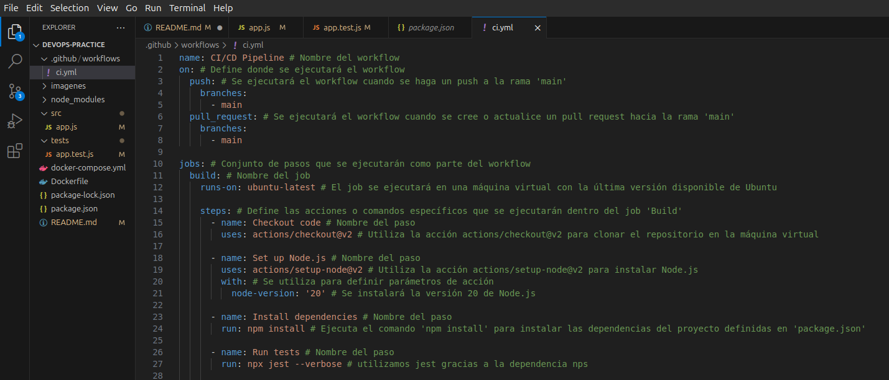

<h3>Parte 2: Configura entrega continua (CD) con Docker</h3>
<h3>- Crea un archivo Docker para contenerizar la aplicación:</h3>

<b>1. Crea un archivo Dockerfile</b>:

En el archivo <b>Dockerfile</b>, comenzamos especificando la imagen base con <b>FROM node:20</b>, lo que indica que utilizaremos la imagen oficial de <b>Node.js</b> en su <b>versión 20</b>. A continuación, establecemos el directorio de trabajo en el contenedor utilizando <b>WORKDIR /app</b>.

Luego, copiamos los archivos <b>package.json</b> y <b>package-lock.json</b> al contenedor con el comando <b>COPY package*.json ./</b> . Para instalar las dependencias necesarias, ejecutamos <b>RUN npm install</b>.

Seguidamente, copiamos el resto de los archivos de la aplicación al contenedor con <b>COPY . .</b>. Posteriormente, exponemos el puerto en el que la aplicación se ejecutará utilizando <b>EXPOSE 3000</b>.

Finalmente, iniciamos la aplicación con el comando <b>CMD ["node", "src/app.js"]</b>.

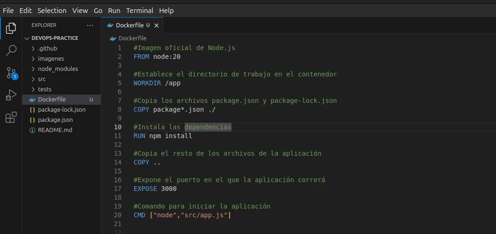

<b>2. Construye la imagen de Docker:</b>

Utilizaremos el comando <b>docker build -t devops-practice . para construir la imagen Docker</b>.

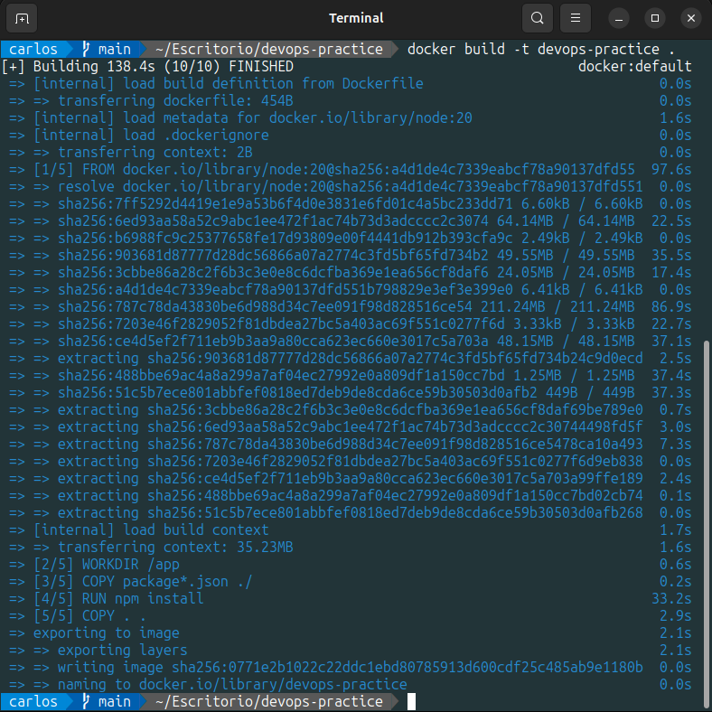

<b>3. Corre el contenedor localmente:</b>

Utilizaremos el comando <b>docker run -p 3000:3000 devops-practice</b> para correr el contenedor Docker localmente en el puerto <b>3000</b>.

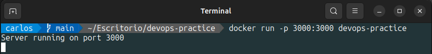

<h3>- Automatiza el despliegue con GitHub Actions:</h3>

<b>1. Actualiza el archivo .github/workflows/ci.yml para construir y desplegar la imagen de Docker:</b>

convierte en la entrada del siguiente. Esto facilita la comunicación y sincronización entre los procesos. El archivo <b>ci.yml</b> se ejecutará cada vez que haya un <b>push</b> o <b>pull request</b> en la rama <b>main</b>.

El funcionamiento del pipeline se define en la sección <b>jobs</b>, que especifica el conjunto de pasos que se ejecutarán como parte del <b>workflow</b>. El primer <b>job</b> se denomina <b>build</b>, y en él utilizaremos <b>runs-on</b> para definir dónde se ejecutará el <b>workflow</b>. En este caso, se ejecutará en una máquina virtual con la última versión disponible de Ubuntu, especificada como <b>ubuntu-latest</b>.

A continuación, en la sección <b>steps</b>, se definen las acciones o comandos específicos que se ejecutarán dentro del job <b>build</b>. El primer paso es usar <b>actions/checkout@v2</b> para clonar el repositorio en la máquina virtual. El segundo paso, denominado <b>"Set up Node.js"</b>, emplea la acción <b>actions/setup-node@v2</b> para instalar la versión 20 de <b>Node.js</b> en la máquina virtual.

El tercer paso, llamado <b>"Install dependencies"</b>, ejecuta el comando <b>npm install</b> para instalar las dependencias necesarias, tal como se definen en <b>package.json</b>. El cuarto paso, <b>"Run tests"</b>, utiliza el comando <b>npx jest --verbose</b> para realizar las pruebas.

En el quinto paso, <b>"Build Docker image"</b>, se emplea el comando <b>docker build -t devops-practice</b> para construir la imagen Docker. Finalmente, el último paso, <b>"Run Docker container"</b>, utiliza el comando <b>docker run -d -p 3000:3000 devops-practice</b> para ejecutar el contenedor Docker en segundo plano, mapeando el puerto 3000 del contenedor al puerto 3000 de la máquina virtual.

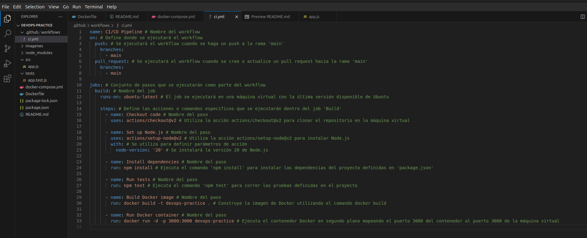

<b>2. Verifica que la aplicación se despliegue correctamente localmente usando Docker:</b>

Utilizamos <b>localhost:300</b> en nuestro navegador para verificar si la aplicacion se ha desplegado correctamente.

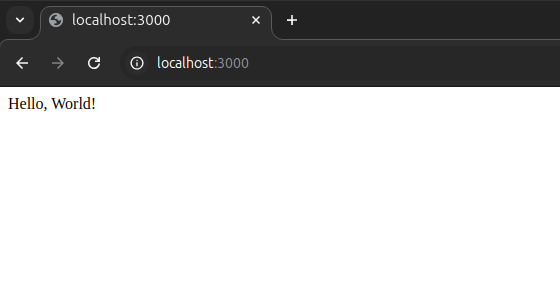

<h2>3. Automatización</h2>
<h3>- Automatiza la configuración y gestión del entorno local usando Docker Compose:</h3>

<b>1. Crea un archivo docker-compose.yml:</b>

Creamos el archivo <b>docker-compose.yml</b>, una herramienta de Docker que permite definir y gestionar aplicaciones compuestas por múltiples contenedores de manera declarativa. Este archivo especifica cómo se deben configurar y ejecutar los diferentes servicios de la aplicación, así como sus volúmenes, redes y otros parámetros.

En nuestro archivo <b>docker-compose.yml</b>, se construirá una imagen utilizando el Dockerfile en el directorio actual. Además, definimos cómo los puertos del contenedor se mapearán a los puertos del host, permitiendo la comunicación entre el contenedor y el exterior. También se establecen las variables de entorno que se pasarán al contenedor al momento de su ejecución, como la configuración de <b>NODE_ENV</b> en modo producción.

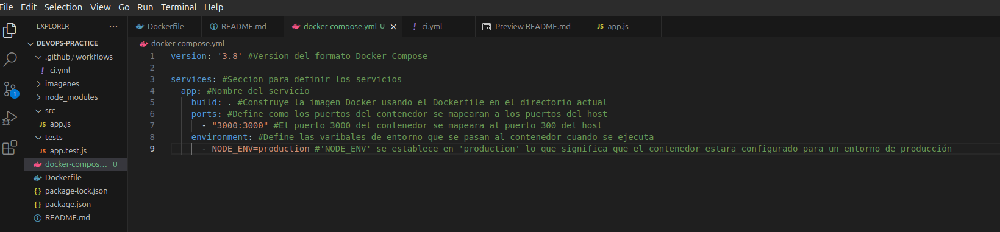

<b>2. Corre la aplicación usando Docker Compose:</b>

Utilizamos el comando <b>docker-compose up --build -d</b> para correr la aplicación utilizando Docker Compose.

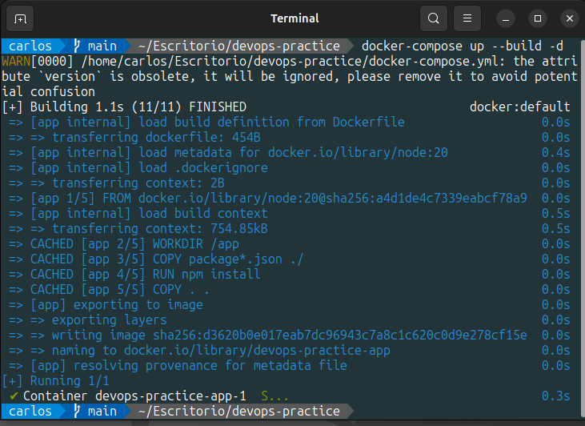