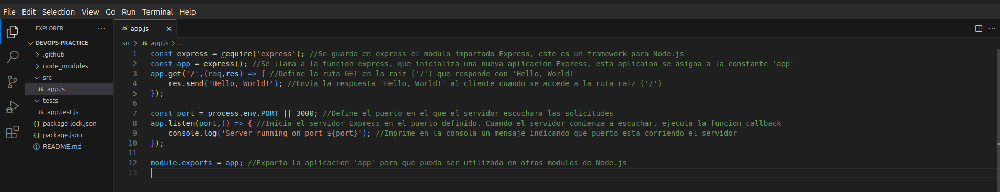
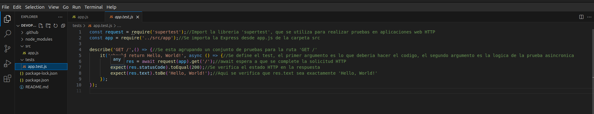
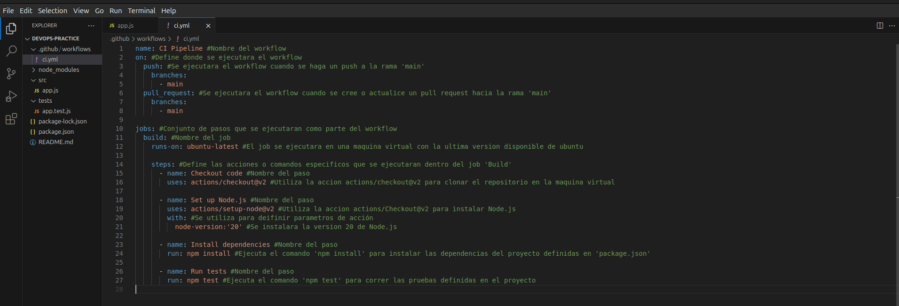
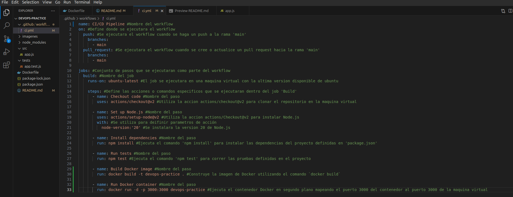

<h1>Actividad1-CC3S2</h1>
<h2>1. Configuración del entorno</h2>

1. Inicializa el proyecto de Node.js:

2. Instala las dependencias necesarias:

3. Crea la estructura del proyecto:

4. Implementa la API REST en src/app.js:

5. Escribe un test básico en tests/app.test.js

6. Configura el script de test en package.json

<h2>2. Pipeline CI/CD</h2>

<h3>Parte 1: Configura integración continua (CI) con GitHub Actions</h3>
<h3>- Crea un archivo de configuración para GitHub Actions:</h3>

1. Crea la estructura para GitHub Actions:

2. Define el flujo de trabajo en <b>.github/workflows/ci.yml</b>:

<h3>Parte 2: Configura entrega continua (CD) con Docker</h3>
<h3>- Crea un archivo Docker para contenerizar la aplicación:</h3>

1. Crea un archivo <b>Dockerfile</b>:

2. Construye la imagen de Docker:

3. Corre el contenedor localmente:

<h3>- Automatiza el despliegue con GitHub Actions:</h3>

1. Actualiza el archivo .github/workflows/ci.yml para construir y desplegar la imagen de Docker:

2. Verifica que la aplicación se despliegue correctamente localmente usando Docker:

<h2>3. Automatización</h2>
<h3>- Automatiza la configuración y gestión del entorno local usando Docker Compose:</h3>

1. Crea un archivo docker-compose.yml:

2. Corre la aplicación usando Docker Compose:

